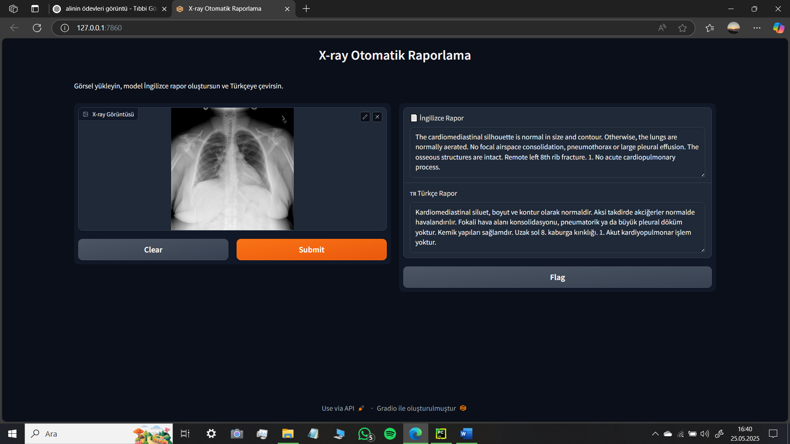

# Tıbbi Görüntülerin Derin Öğrenme Yaklaşımlarıyla Otomatik Raporlanması




## 📖 Proje Tanımı  
Bu proje, göğüs röntgeni (X-ray) görüntülerinden derin öğrenme tabanlı bir Encoder–Decoder mimarisi (ResNet-50 + GPT-2) kullanarak otomatik İngilizce rapor üretiyor, ardından facebook/nllb-200-distilled-600M modeliyle Türkçeye çeviriyor. Sonuçlar hem terminal hem de Gradio tabanlı web arayüzünde kullanıcıya sunuluyor :contentReference[oaicite:0]{index=0}.

## ✨ Özellikler  
- **Encoder–Decoder Mimarisi**: ResNet-50 ile görsel öznitelik çıkarımı, GPT-2 ile metin üretimi :contentReference[oaicite:1]{index=1}.  
- **Otomatik Çeviri**: Üretilen İngilizce raporlar facebook/nllb-200-distilled-600M ile Türkçeye dönüştürülür :contentReference[oaicite:2]{index=2}.  
- **Modüler Python Yapısı**: Veri hazırlama, model tanımı, eğitim, rapor üretimi, çeviri ve arayüz bileşenleri bağımsız modüller halinde ayrılmıştır :contentReference[oaicite:3]{index=3}.  
- **Etkileşimli Arayüz**: Gradio ile kullanıcı dostu web arayüzü üzerinden uçtan uca otomasyon :contentReference[oaicite:4]{index=4}.

## 🛠️ Teknolojiler  
- **Python 3.8+**  
- **PyTorch** & **Hugging Face Transformers**  
- **ResNet-50**, **GPT-2**  
- **facebook/nllb-200-distilled-600M** (NLLB çeviri modeli)  
- **Gradio** (Web UI Framework) :contentReference[oaicite:5]{index=5}

## 🚀 Kurulum & Çalıştırma  
1. Depoyu klonlayın  
   ```bash
   git clone https://github.com/KULLANICI_ADINIZ/medical-image-reporting.git
   cd medical-image-reporting
